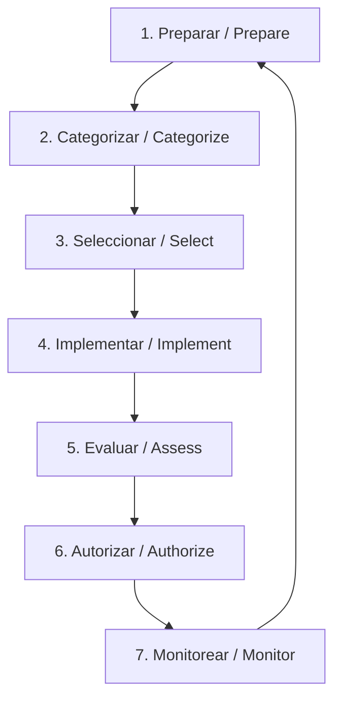

# 📈 Marco de Gestión de Riesgos (NIST RMF)

El **NIST Risk Management Framework (RMF)** (Publicación Especial SP 800-37) es un proceso estructurado y adaptable de siete pasos concebido para integrar la seguridad de la información, la privacidad y la gestión de riesgos en el ciclo de vida de los sistemas de información y las organizaciones.

A diferencia del CSF (que ofrece una vista general de la postura de seguridad), el RMF es un **proceso operativo detallado paso a paso** para implementar controles específicos en un sistema tecnológico particular.

---

## 🔄 Los 7 Pasos del Ciclo de Vida del RMF

1.  **Preparar (Prepare):** Actividades esenciales a nivel de organización y de sistema para establecer las bases y el contexto de la gestión de riesgos.
2.  **Categorizar (Categorize):** Clasificar el sistema de información y la información procesada en función del impacto potencial de una pérdida de Confidencialidad, Integridad y Disponibilidad (Tríada CIA).
3.  **Seleccionar (Select):** Elegir un conjunto inicial de controles de seguridad y privacidad (generalmente del catálogo NIST SP 800-53) para proteger el sistema según su categoría de impacto.
4.  **Implementar (Implement):** Aplicar los controles seleccionados en el sistema y documentar detalladamente cómo operan.
5.  **Evaluar (Assess):** Verificar si los controles están implementados correctamente, operan según lo previsto y producen el resultado deseado en seguridad.
6.  **Autorizar (Authorize):** Un ejecutivo senior (la Autoridad Autorizadora) evalúa el riesgo residual del sistema y decide formalmente si aprueba su puesta en producción.
7.  **Monitorear (Monitor):** Realizar un seguimiento continuo sobre el estado de los controles, detectar cambios en el entorno del sistema y evaluar nuevas amenazas periódicamente.

---

## 📝 Nota de Estudio (Study Note) - Tríada CIA & Riesgo Residual

*   **Concepto clave de Google Cybersecurity Certificate:** *CIA Triad & Residual Risk* (Tríada CIA y Riesgo Residual).
*   **Triángulo de Seguridad (Confidencialidad, Integridad, Disponibilidad):** Todo el proceso de categorización del RMF se basa en evaluar el impacto de una falla en cualquiera de estos tres pilares.
*   **Traducción y Resumen Práctico:** **El riesgo cero no existe**. Después de seleccionar e implementar todos los controles de seguridad en un sistema, siempre quedará una pequeña parte de vulnerabilidad latente. Esto se conoce como **riesgo residual**. El paso de "Autorizar" del RMF asegura que la organización asuma conscientemente ese riesgo antes de que un sistema empiece a procesar datos críticos de clientes o del negocio.
