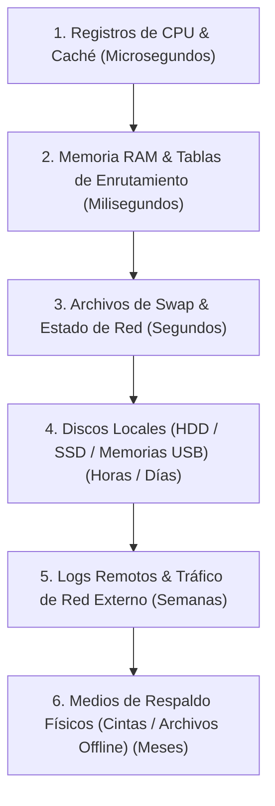

# 🔍 Preservación de Evidencias y Orden de Volatilidad

En la respuesta a incidentes y el análisis forense digital, la forma en que se interactúa con un sistema comprometido determina si las evidencias recolectadas serán válidas en un juicio o investigación oficial.

La regla de oro de la informática forense es: **alterar lo menos posible el estado original del sistema y documentar de manera estricta cada paso.**

---

## ⚡ El Orden de Volatilidad (Order of Volatility)

Los datos digitales expiran a ritmos diferentes. Al recolectar evidencias, se debe priorizar la captura de los datos más volátiles (los que desaparecen más rápido) antes de proceder con los menos volátiles.

Siguiendo el estándar **RFC 3227**, el orden de volatilidad de mayor a menor es el siguiente:

### 1. Registros y Caché del Procesador
*   **Volatilidad:** Extrema. Cambian constantemente a nivel de hardware.
*   **Ejemplo:** Registros de CPU, caché L1/L2/L3.

### 2. Memoria de Acceso Aleatorio (RAM)
*   **Volatilidad:** Alta. Se pierde por completo al apagar o reiniciar el equipo.
*   **Ejemplo:** Procesos en ejecución, conexiones de red abiertas, contraseñas temporalmente almacenadas en texto plano, malware inyectado que no toca el disco duro.

### 3. Estado de Red y Datos Temporales
*   **Volatilidad:** Media-Alta.
*   **Ejemplo:** Caché de ARP, tablas de enrutamiento activas, puertos abiertos y sockets de red abiertos.

### 4. Sistemas de Almacenamiento Secundario
*   **Volatilidad:** Media-Baja. Permanecen al apagar el equipo, pero pueden ser sobrescritos por el sistema operativo.
*   **Ejemplo:** Discos duros internos (HDD/SSD), particiones de intercambio (Swap) y dispositivos USB.

### 5. Registros Remotos (Logs) y Monitoreo de Red
*   **Volatilidad:** Baja. Generalmente almacenados en servidores SIEM o servidores de registro centralizados.

---

## 📝 Nota de Estudio (Study Note) - Cadena de Custodia Rota

*   **Concepto clave de Google Cybersecurity Certificate:** *Chain of Custody* (Cadena de Custodia).
*   **Traducción y Resumen Práctico:** La cadena de custodia es la bitácora cronológica e ininterrumpida que registra la recolección, transferencia, análisis y almacenamiento de una prueba digital. **Si la cadena de custodia se rompe (por ejemplo, si un técnico mueve un disco de evidencia sin registrarlo, o si la firma digital hash de la copia forense no coincide con el original), la evidencia pierde integridad ante un tribunal** y es descartada de inmediato.
