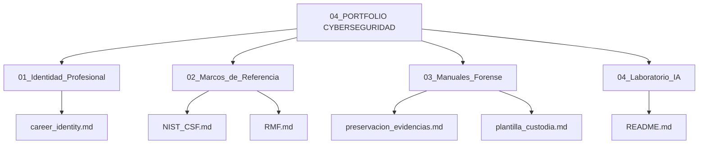

# 🛡️ Portfolio de Ciberseguridad & Aprendizaje Continuo

Bienvenido a mi espacio de documentación, laboratorio y desarrollo profesional en ciberseguridad. Este repositorio sirve como motor de conocimiento activo y bitácora de aprendizaje práctico, estructurado bajo estándares profesionales de la industria.

El objetivo de este portafolio es documentar de forma clara, técnica y concisa mis competencias en gestión de riesgos, marcos de referencia, forense digital e integración de herramientas modernas de Inteligencia Artificial para el análisis de seguridad.

---

## 🗺️ Estructura del Portafolio

### 📁 Módulos y Contenidos

*   **`01_Identidad_Profesional/`**: Definición de mi perfil profesional, enfoque ético y filosofía como profesional en aprendizaje constante y disciplinado.
*   **`02_Marcos_de_Referencia/`**: Documentación de marcos metodológicos esenciales como NIST CSF (Cybersecurity Framework) y NIST RMF (Risk Management Framework).
*   **`03_Manuales_Forense/`**: Guías técnicas sobre preservación de evidencia, orden de volatilidad de datos y plantillas para la Cadena de Custodia.
*   **`04_Laboratorio_IA/`**: Registro de experimentos, scripts y optimización de flujos de trabajo utilizando Inteligencia Artificial para análisis rápido de código y algoritmos.

---

## 🎯 Enfoque Metodológico
Este portfolio está alineado con los contenidos prácticos del **Certificado Profesional de Ciberseguridad de Google**, complementado con análisis autónomo y experimentación práctica. Cada documento incluye una **Nota de Estudio (Study Note)** que conecta los conceptos con su aplicación en entornos corporativos reales.
